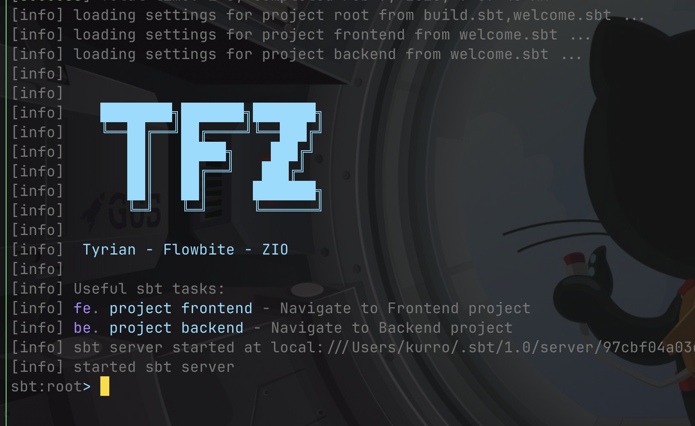
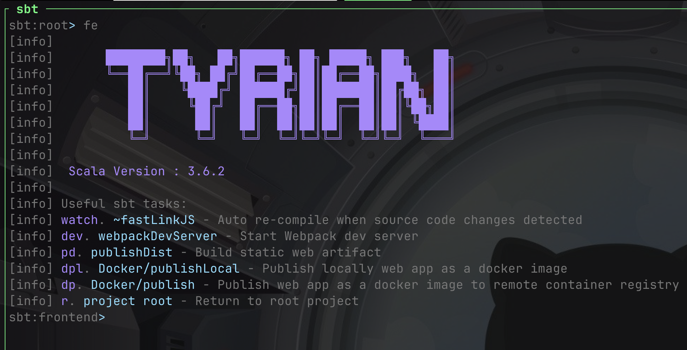
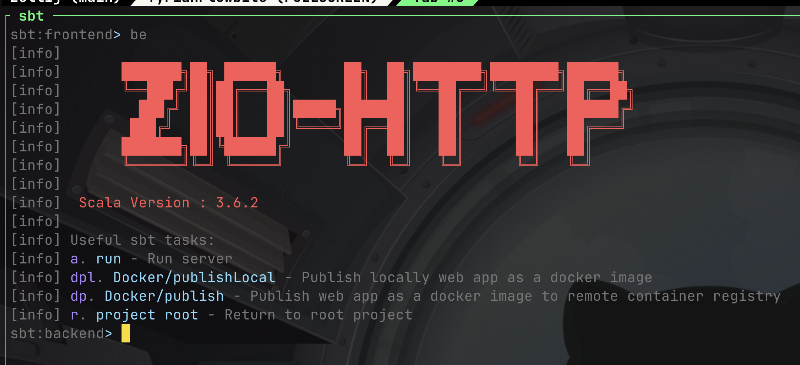

A [Giter8][g8] Frontend template project for [Tyrian Framework](https://tyrian.indigoengine.io/) integrated with [Flowbite](https://flowbite.com/)

# Scala Project Template with Tyrian, Flowbite, and ZIO
This template sets up a Scala.js project using the Tyrian framework for UI, ZIO-HTTP for backend integration (Optional), and Flowbite for additional UI components. Tyrian is a powerful, type-safe framework for building web applications with Scala.js, Flowbite provides a rich set of Tailwind CSS components, and ZIO-HTTP offers an efficient and functional backend solution.





---


## Demos

- [Live demo - Fullstack](https://fullstack-zio-tyrian-flowbite-quickstart.onrender.com/)
- [Live demo - Frontend only](https://tyrian-flowbite-quickstart.onrender.com/)
- [Live demo - Todo App fullstack](https://zio-tyrian-flowbite-todos-app.onrender.com)
- [Example project - Fullstack](https://github.com/linux-root/fullstack-zio-tyrian-flowbite-quickstart)
- [Example project - Frontend only](https://github.com/linux-root/tyrian-flowbite-quickstart)
- [Example project - Todo App fullstack](https://github.com/linux-root/zio-tyrian-flowbite-todos-app)
  

---

## Features

### Scala.js Integration
Seamlessly leverage **Scala.js** to build highly performant web applications in Scala. This allows you to write type-safe code that compiles to JavaScript, ensuring reliability and maintainability.

### Tyrian Framework
Utilize the power of the **Tyrian framework** for building robust and reactive front-end web applications in Scala. This framework simplifies state management and UI rendering, enhancing development efficiency.

### Flowbite Components
Enhance your UI with **Flowbite's** responsive and customizable components, providing a modern look right out of the box.

### Tailwind CSS
Style your application with **Tailwind CSS**, a utility-first framework that enables rapid custom design development.

### Docker Deployment
The project includes ready-to-use **Docker configurations** for production deployment. This ensures consistency across environments and simplifies the deployment process.

### Fullstack Option
Integrate with **ZIO-HTTP** for a complete fullstack solution, using a Scala cross-project to share source code between the frontend and backend, enabling efficient and seamless development of both components.

### Frontend Effect Systems
Choose between effect systems at the frontend: **ZIO** or **Cats Effect**, providing flexibility based on your project requirements.

### CLI Integration
Enjoy a ready-to-use **CLI** seamlessly integrated with JavaScript tools (npm, webpack, Tailwind, etc.) directly from the SBT console, streamlining your development workflow.

---

## Getting Started

```bash
sbt new linux-root/tyrian-flowbite.g8

# OR
g8 linux-root/tyrian-flowbite.g8

# OR
mill -i init linux-root/tyrian-flowbite.g8

```

### Prerequisites

- [Java JDK](https://www.oracle.com/java/technologies/javase-jdk11-downloads.html) (11 or higher)
- [sbt](https://www.scala-sbt.org/download.html) (Scala Build Tool)
- [Nodejs V22.13.0](https://nodejs.org/en/blog/release/v22.13.0)

## Template license

Written in 2024 by Watson Dinh <mr.kurro@gmail.com>

To the extent possible under law, the author(s) have dedicated all
copyright and related and neighboring rights to this template to
the public domain worldwide.
This template is distributed without any warranty. See <https://creativecommons.org/publicdomain/zero/1.0/>.

[g8]: https://www.foundweekends.org/giter8/
