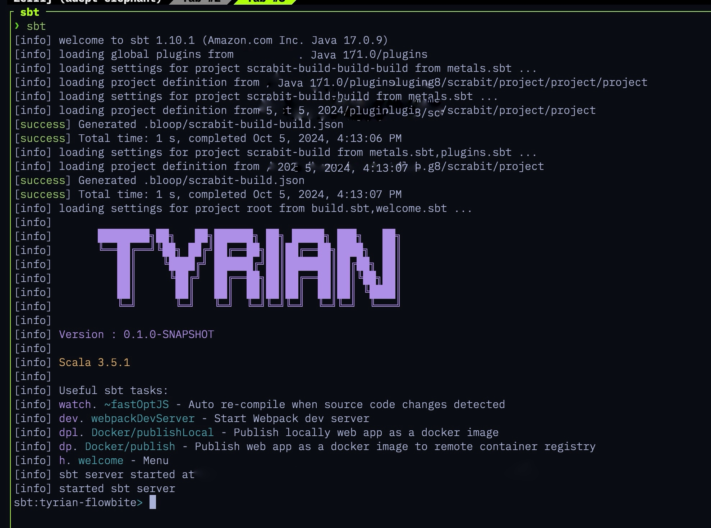

A [Giter8][g8] Frontend template project for [Tyrian Framework](https://tyrian.indigoengine.io/) integrated with [Flowbite](https://flowbite.com/)
# Scala.js Project Template with Tyrian and Flowbite

Welcome to the Scala.js Project Template! This template sets up a Scala.js project using the Tyrian framework and Flowbite for UI components. Tyrian is a powerful, type-safe framework for building web applications with Scala.js, and Flowbite is a Tailwind CSS component library that provides beautiful and customizable UI elements.



---

## Features

- **Scala.js Integration**: Seamlessly leverage Scala.js to build highly performant web applications in Scala, allowing you to write type-safe code that compiles to JavaScript.
  
- **Tyrian Framework**: Utilize the power of the Tyrian framework for building robust and reactive front-end web applications in Scala, simplifying state management and UI rendering.

- **Flowbite Components**: Enhance your user interface with Flowbite's pre-designed, responsive, and customizable components, providing a modern and polished look out of the box.

- **Tailwind CSS**: Style your application effortlessly with Tailwind CSS, a highly customizable utility-first CSS framework that enables rapid development of custom designs.

- **Docker Deployment**: The project includes ready-to-use Docker configurations for production deployment, ensuring consistency across environments and simplifying the deployment process.

---
## Getting Started

```bash
sbt new linux-root/tyrian-flowbite.g8

# OR
g8 linux-root/tyrian-flowbite.g8

# OR
mill -i init linux-root/tyrian-flowbite.g8

```

### Prerequisites

- [Java JDK](https://www.oracle.com/java/technologies/javase-jdk11-downloads.html) (11 or higher)
- [sbt](https://www.scala-sbt.org/download.html) (Scala Build Tool)

Template license
----------------
Written in 2024 by Watson Dinh <mr.kurro@gmail.com>

To the extent possible under law, the author(s) have dedicated all copyright and related
and neighboring rights to this template to the public domain worldwide.
This template is distributed without any warranty. See <https://creativecommons.org/publicdomain/zero/1.0/>.

[g8]: https://www.foundweekends.org/giter8/
